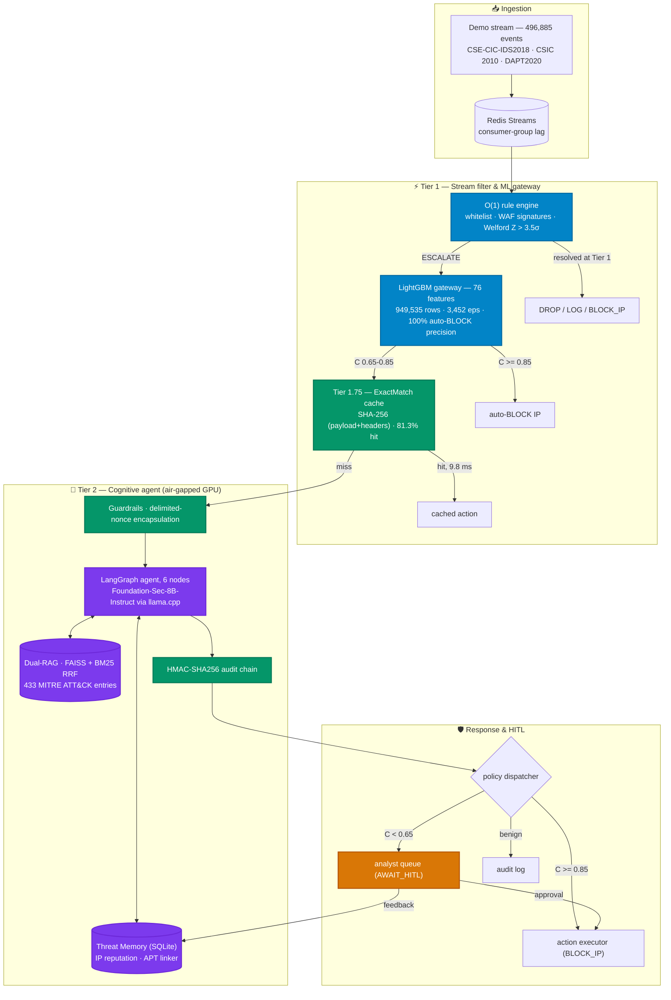

# 🛡️ SENTINEL — A Cognitive Two-Tier Architecture for Automated Threat Detection and Contextual Response using Agentic AI

<div align="center">

[](LICENSE)
[](https://www.python.org/)
[](docker-compose.yml)
[](https://github.com/Binhchuoizzz/AI_Security_Graph/actions/workflows/ci.yml)
[](tests/)
[](docs/Thesis/latex/)
[](docs/Thesis/slides/index.html)

</div>

> **SENTINEL** is a two-tier Security Operations Center (SOC) architecture that routes each event by cost:
> a deterministic $\mathcal{O}(1)$ stream filter and a LightGBM gateway resolve the bulk of traffic, and only
> the residue reaches a LangGraph reasoning agent running a local LLM. It targets three bottlenecks —
> **alert fatigue and latency**, **SOAR rigidity and LLM hallucination**, and **adversarial attacks on the AI itself** —
> and runs **100% on-premises** on a single NVIDIA RTX 4060 Ti (16 GB VRAM).

---

## Thesis & Defense Materials

| Artifact | Link |
| :--- | :--- |
| Submitted thesis (PDF, 40 pp) | [`MSE23HN_NguyenDucBinh_24MSE13183.pdf`](docs/Thesis/MSE23HN_NguyenDucBinh_24MSE13183.pdf) |
| LaTeX source — English / Vietnamese | [`thesis_latex_en`](docs/Thesis/latex/thesis_latex_en/main.pdf) · [`thesis_latex_vi`](docs/Thesis/latex/thesis_latex_vi/main.pdf) |
| Defense deck (20 slides, offline HTML) | [Live deck](https://binhchuoizzz.github.io/AI_Security_Graph/docs/Thesis/slides/) · [`index.html`](docs/Thesis/slides/index.html) |
| Number audit ledger (machine-readable) | [`thesis_number_audit.json`](experiments/results/thesis_number_audit.json) |

The two LaTeX builds are a token-for-token mirror: `audit_thesis_numbers.py` reports **0 numeric divergences** between them.

---

## Measured Results

All figures below are read straight from `experiments/results/*.json`. Hardware: RTX 4060 Ti 16 GB,
`Foundation-Sec-8B-Instruct Q4_K_M` served by local `llama.cpp` (CUDA).

| Dimension | Headline | Denominator and caveat |
| :--- | :--- | :--- |
| **1 · Offload & latency** | **97.5% offload · 0.88 ms median · 3,452 eps** | Offload is a property of the traffic mix, not a constant: **97.47%** at a 9.77% attack base rate, **90.57%** at 31.56%. Median latency drops 17,174.7 → 0.88 ms, but **p95 gets worse** (25,829 vs 21,434 ms) — escalated cases pay both tiers. |
| **2 · Adversarial & integrity** | **100% injection resistance · 98.75% evasion resistance · 100% tamper detection** | 678/678 hard adversarial samples; evasion measured on the hard `extreme_broad` mode only (1,023/1,036). HMAC chain catches edits, insertions and mid-deletions 30/30 each — **but not tail truncation (0/30)**. |
| **3 · ATT&CK attribution & RAG** | **80.0% retrieval-only · 68.0% full pipeline · 0/1,421 unanchored** | Attribution is **worse with the reasoning tier than without it** — reported as a limitation. Dual-RAG Recall@3 = 0.930 on the payload slice, **0.385 on the full slice**. The grounding shield fired on 9.26% of batches and blocked **76 ungroundable `BLOCK_IP` actions**. |
| **4 · Triage & HITL queue** | **−84.24% analyst load at 95.0% threat coverage** | As a binary classifier the reasoning tier is worthless (**MCC 0.0**, 99.55% FP on confirmations). Its value is as a *router*: the deferred queue is 15.76% of volume, 6.03× enriched, and holds 76/80 real threats. |
| **5 · Reasoning quality** | **3.78 / 5.0 mean** (Relevancy 4.52 · Ctx-Precision 2.54) | Cross-family LLM-as-judge (`Meta-Llama-3-8B-Instruct` judging `Foundation-Sec-8B`), n = 1,052. Only **11.2%** of justifications cite a checkable log value — the weakest link in the system. |

> [!IMPORTANT]
> **The 97.5% figure has a specific denominator.** It was measured on the **2026-08-05 build** of the demo
> stream — 99,717 scored events, 9.77% attack, no CSIC 2010. The current `data/demo.json` is a later,
> larger rebuild (496,885 events, CSIC included), so re-running
> `measure_offload_vs_baserate.py --source demo` today will **not** reproduce 97.5%. The 90.57% figure on
> the 25,649-event benchmark stream is unaffected.

---

## Architecture



### Components

| # | Component | Layer | Key specification |
| :-: | :--- | :---: | :--- |
| 1 | Rule engine | Tier 1 | $\mathcal{O}(1)$ filter + Welford online variance; $Z > 3.5\sigma$ flags zero-day, risk score $\geq 15$ escalates. |
| 2 | ML gateway | Tier 1 | LightGBM, 76 features, 949,535 NetFlow rows; 4-band policy; 3,452 eps; 100% auto-BLOCK precision (962 / 0 FP). |
| 3 | ExactMatch cache | Tier 1.75 | SHA-256 over payload + headers; 81.3% hit rate, 8.9× speedup (9.8 ms vs 87.7 ms). |
| 4 | Guardrails | Security | Delimited-nonce encapsulation of untrusted logs; 678/678 hard samples resisted. |
| 5 | Dual-RAG | Tier 2 | FAISS + BM25 fused by RRF ($k = 60$) over 433 STIX ATT&CK entries and 13 NIST SP 800-61r2 controls. |
| 6 | Cognitive agent | Tier 2 | LangGraph 6-node DAG: `guardrails → rag_context → llm_triage → attack_mapper → action_executor / human_in_the_loop`; ~7–8 GB VRAM. |
| 7 | Grounding shield | Tier 2 | Rejects ATT&CK IDs absent from the batch's own retrieved documents; 0 / 1,421 unanchored assertions. |
| 8 | Threat Memory | Storage | SQLite (`synchronous=NORMAL`, no WAL for Docker cross-UID stability); reputation decay + multi-day APT linking. |
| 9 | HMAC audit chain | Integrity | $H_i = \mathrm{HMAC}(D_i \parallel H_{i-1}, K)$, key from `SENTINEL_LOG_SECRET`; detects edit/insert/mid-delete, **not** tail truncation. |
| 10 | Backpressure | Infra | Redis consumer-group **lag** via `XREADGROUP` / `XACK` (not `XLEN`). |
| 11 | SOC dashboard | UI | Streamlit — funnel view, live audit log, one-click HITL approval. |

---

## Quick Start

Full operating guide: **[`RUN_PROJECT.md`](docs/Codebase/guides/RUN_PROJECT.md)**.
Requires Linux, Python 3.10+, 32 GB RAM, ~50 GB disk, and an NVIDIA GPU with ≥ 16 GB VRAM.

```bash
git clone https://github.com/Binhchuoizzz/AI_Security_Graph.git && cd AI_Security_Graph
python3.10 -m venv .venv && source .venv/bin/activate
pip install -r requirements.txt
cp .env.example .env                 # set SENTINEL_LOG_SECRET here — no hardcoded fallback exists
python -m src.rag.embedder           # build FAISS + BM25 indexes
```

Build the demo stream, then launch. **Order matters**: `build_demo.py` reads `data/csic.json`, so
reversing the two silently yields a stream with zero CSIC records and no application-layer evidence.
`data/demo.json` is ~830 MB and is not tracked in git.

```bash
python scripts/build_csic_dataset.py --limit 36000     # ~1 min
python scripts/build_demo.py                           # ~4 min, ~4 GB RAM
UNIFIED_STREAM_DELAY=0 UNIFIED_STREAM_BATCH=500 \
  ./scripts/run_demo.sh --fresh                        # infra + dashboard + full push
```

Dashboard at **`http://localhost:8501`** (user `manager`). Use `--small` for a ~10,000-event stratified
subset that populates every panel in minutes.

The two `UNIFIED_STREAM_*` overrides matter: `scripts/demo.py` defaults to a fixed
`sleep(0.3)` per 50-event batch, capping ingest at ~167 events/s no matter how much headroom the
consumer has. Measured 2026-08-17: **164.8 events/s** with the defaults versus **1,454 events/s**
without, cutting the push phase from ~50 minutes to ~6. Safety is unaffected — `_wait_for_capacity()`
already gates every batch on real consumer-group lag (< 5,000) and LLM backlog (< 2,000).

### Demo stream composition

496,885 events, 100% real records, **26,019 attacks = 5.24%**, 22 distinct attack classes. Counted
directly from `data/demo.json` by the `unified_source` key.

| Source | Events | Attacks | Role |
| :--- | ---: | ---: | :--- |
| CSE-CIC-IDS2018 NetFlow (10 days) | 456,849 | 5,296 | Benign-heavy volume base, resolved at Tier 1 |
| CSIC 2010 HTTP payloads | 36,000 | 18,000 | Application-layer evidence — primary attribution source |
| DAPT2020 (volume + real chains) | 1,902 | 669 | Multi-day kill-chain correlation |
| `ground_truth` slice | 1,250 | 1,170 | Covers all 15 labelled CICIDS classes |
| Prompt injection + jailbreak | 730 | 730 | deepset + jackhhao public corpora (AML.T0051) |
| Zero-day probes + OWASP | 154 | 154 | Signature-less, caught by Welford $Z$-score |

Of the 402 DAPT2020 chain records, **3 attacker IPs carry attack-phase activity on ≥ 2 distinct days** —
the system detects 3 / 3.

---

## Tests and Benchmarks

`SENTINEL_FREEZE_DYNAMIC_RULES=1` is **required** for every command below. Without it the ML gateway
writes hundreds of learned rules straight into the shared `config/system_settings.yaml`.

```bash
SENTINEL_FREEZE_DYNAMIC_RULES=1 pytest        # 613 collected: 609 pass, 4 skip without Redis
python experiments/e2e_test_runner.py --offline    # functional harness, 15/15 PASS
python experiments/evaluate_unified_stream.py      # 5D empirical evaluation
python experiments/run_ablation.py --mode all      # action-based ablation
```

### Verifying the numbers

```bash
python scripts/audit_thesis_numbers.py        # claim ↔ result-key ↔ thesis text, EN/VI mirror
python scripts/audit_thesis_refs.py           # 41 IEEE bibliography entries
python scripts/audit_metric_denominators.py   # denominator and saturation traps
```

Current state, reported honestly:

- **`audit_thesis_numbers`** — 134 registered claims: **106 match**, 28 are registered but no longer
  appear in the thesis (Chapter 4 was trimmed and these claims were never deregistered), **0 EN↔VI
  divergences**. The 28 are a bookkeeping backlog in the script's `CLAIMS` table, not contradictions
  in the thesis.
- **`audit_thesis_refs`** — all checks pass: 0 orphans, 0 dangling, 0 mirror drift, 0 IEEE ordering errors.
- **`audit_metric_denominators`** — 13 checks, **4 deliberate flags** that must be quoted alongside their
  metric (ML gateway 59.82% bypass rate, seed-variance saturation, evasion-mode saturation, triage cache hits).

---

## License & Citation

MIT — see [`LICENSE`](LICENSE).

**Nguyễn Đức Bình** (`24MSE13183`, class `MSE23HN`) · Master of Software Engineering ·
FSB Institute of Management & Technology, FPT University, Hanoi ·
Supervisors: Dr. Bùi Văn Hiệu, Dr. Đặng Văn Hiếu.

```bibtex
@mastersthesis{nguyen2026sentinel,
  author  = {Nguyen Duc Binh},
  title   = {SENTINEL: A Cognitive Two-Tier Architecture for Automated Threat
             Detection and Contextual Response using Agentic AI},
  school  = {FSB Institute of Management \& Technology, FPT University},
  year    = {2026},
  type    = {Master's Thesis},
  address = {Hanoi, Vietnam}
}
```
