# 🧠 Bản Đồ Quyết Định SENTINEL — Tier-1 vs Tier-2

## Tổng quan Kiến trúc Ra Quyết Định

```mermaid
flowchart TD
    LOG_IN["📥 Log đầu vào\n(Redis Stream)"] --> SUB["subscriber.py\n(Nhận log)"]
    SUB --> T1["⚡ Tier-1 Filter\nrule_engine.evaluate()"]
    
    T1 --> |"score < 50\nkhông có reasons"| DROP["🗑️ DROP\n(Vứt bỏ)"]
    T1 --> |"score < 50\ncó reasons nhẹ"| LOG_ACT["📝 LOG\n(Ghi sổ)"]
    T1 --> |"IP trong Whitelist"| WL["✅ WHITELIST_DROP\n(Cho qua đặc cách)"]
    T1 --> |"Reputation ≥ Block"| T1_BLOCK["🛑 Tier-1 BLOCK_IP"]
    T1 --> |"Dynamic rule khớp"| T1_BLOCK
    T1 --> |"WAF match\n(SQLi/XSS/CmdInj)"| T1_BLOCK
    T1 --> |"Port nhạy cảm\n+ pkt < 200"| T1_BLOCK
    T1 --> |"Fwd pkts > max"| T1_ALERT["⚠️ Tier-1 ALERT"]
    T1 --> |"Port lạ\n(không 80/443)"| T1_HITL["🧑‍💻 Tier-1 AWAIT_HITL"]
    T1 --> |"Prompt Injection\nhoặc mờ ám"| ESC["🔀 ESCALATE\n→ Tier-2"]
    
    T1_BLOCK --> BLK_FILE["tier1_blocks.json\n(KHÔNG vào audit_trail)"]
    T1_ALERT --> Q_DEC["queue_decisions\n(Redis)"]
    T1_HITL --> Q_HITL["queue_hitl\n(Redis)"]
    WL --> AUD_WL["audit_trail DB\n(action=WHITELIST)"]
    
    ESC --> BUF["ip_buffers\n(gom 10 log/IP)"]
    BUF --> |"đủ batch_size"| T2["🧠 Tier-2 Agent\nLangGraph Workflow"]
    
    T2 --> GR["1. Guardrails\n(Nén + Lọc)"]
    GR --> RAG["2. RAG Context\n(MITRE + NIST)"]
    RAG --> LLM["3. LLM Triage\n(Gemma-2-9B-IT)"]
    LLM --> |"confidence > 0.7\n+ threat"| MAP["4. Attack Mapper\n(MITRE cấu trúc)"]
    LLM --> |"LOG/benign"| T2_END["🏁 Kết thúc"]
    MAP --> |"BLOCK_IP\n(Tấn công rõ ràng, đa bước,\nhoặc nhắm port nhạy cảm)"| EXEC["5. Action Executor\n→ block_ip() / alert()"]
    MAP --> |"ALERT\n(Bất thường nhẹ, hoặc DDoS\nnghi vấn spoof IP)"| EXEC
    MAP --> |"AWAIT_HITL\n(Mơ hồ, mục tiêu VIP,\nhoặc xung đột với Tier-1)"| T2_HITL["6. HITL Node\n→ _log_to_db(AWAIT_HITL)"]
    
    EXEC --> AUD_T2["audit_trail DB\n(BLOCK_IP/ALERT)"]
    T2_HITL --> AUD_T2
    
    style T1 fill:#1a1a2e,stroke:#e94560
    style T2 fill:#0f3460,stroke:#00d2ff
    style T1_BLOCK fill:#ff4757,color:#fff
    style ESC fill:#ffa502,color:#000
    style WL fill:#2ed573,color:#000
```



---

## 🔴 TIER-1: Rule Engine (Bộ lọc tốc độ cao, KHÔNG dùng LLM)

> **File chính:** [rule_engine.py](file:///home/binhchuoiz/Projects/Thesis/AI_Security_Graph/src/tier1_filter/rule_engine.py)  
> **Hàm quyết định:** [evaluate()](file:///home/binhchuoiz/Projects/Thesis/AI_Security_Graph/src/tier1_filter/rule_engine.py#L562-L790)  
> **Dispatcher:** [subscriber.py](file:///home/binhchuoiz/Projects/Thesis/AI_Security_Graph/src/streaming/subscriber.py#L319-L382)

### Cơ chế chấm điểm (Scoring Layers)

Tier-1 tính `score` cộng dồn qua **6 tầng kiểm tra**, mỗi tầng cộng điểm vào rổ:

| Tầng | Tên | Điểm cộng | Code | Dựa trên |
|------|-----|-----------|------|----------|
| 0.1 | **WAF Signatures** | +50 | [L599-603](file:///home/binhchuoiz/Projects/Thesis/AI_Security_Graph/src/tier1_filter/rule_engine.py#L599-L603) | Regex match payload/URI cho SQLi, XSS, Command Injection |
| 0.2 | **Prompt Injection** | +50 | [L605-609](file:///home/binhchuoiz/Projects/Thesis/AI_Security_Graph/src/tier1_filter/rule_engine.py#L605-L609) | Regex match "ignore previous", "system prompt", jailbreak |
| 0.5 | **Z-Score Anomaly** | +5~40 | [L611-653](file:///home/binhchuoiz/Projects/Thesis/AI_Security_Graph/src/tier1_filter/rule_engine.py#L611-L653) | Welford online stats — so sánh giá trị mạng hiện tại với trung bình/std chuẩn đã học |
| 1.0 | **Static Rules** | +40 (port) / +30 (pkt) | [L655-671](file:///home/binhchuoiz/Projects/Thesis/AI_Security_Graph/src/tier1_filter/rule_engine.py#L655-L671) | Port nhạy cảm (22,21,3389...) hoặc số gói tin bất thường |
| 2.0 | **Dynamic Rules** | +50~100 | [L673-690](file:///home/binhchuoiz/Projects/Thesis/AI_Security_Graph/src/tier1_filter/rule_engine.py#L673-L690) | Luật do Tier-2 Agent đẻ ra, đã được Analyst duyệt (ACTIVE) → Feedback Loop |
| 3.0 | **Session Baseline** | tuỳ deviation | [L692-698](file:///home/binhchuoiz/Projects/Thesis/AI_Security_Graph/src/tier1_filter/rule_engine.py#L692-L698) | So sánh hành vi IP này vs hành vi "bình thường" của chính nó (tần suất, port) |
| 3.5 | **Reputation** | N/A (đè action) | [L700-717](file:///home/binhchuoiz/Projects/Thesis/AI_Security_Graph/src/tier1_filter/rule_engine.py#L700-L717) | Điểm danh tiếng từ Threat Memory (tiền sử tấn công) |

### Cây quyết định hành động (Action Routing)

> **Code:** [L728-781](file:///home/binhchuoiz/Projects/Thesis/AI_Security_Graph/src/tier1_filter/rule_engine.py#L728-L781)

```
Ưu tiên 1: is_whitelisted == True?
  └─ CÓ → WHITELIST_DROP (cho qua, đè TẤT CẢ)

Ưu tiên 2: rep_action == "BLOCK_IP"? (tiền sử khét lẹt)
  └─ CÓ → BLOCK_IP (chặn ngay, bất kể score)

Ưu tiên 3: score >= risk_threshold (50)?
  └─ KHÔNG → reasons có? LOG : DROP
  └─ CÓ → Phân nhánh chi tiết:

      3a. dynamic_ip_block == True? (IP đã duyệt chặn)
          → BLOCK_IP

      3b. has_waf_match? (SQLi/XSS/CmdInj chắc chắn)
          → BLOCK_IP

      3c. has_injection_match? (Prompt Injection/Jailbreak)
          → ESCALATE (cần LLM hiểu ngữ cảnh)

      3d. port nhạy cảm + pkt < 200? (BruteForce)
          → BLOCK_IP

      3e. fwd_pkts > max? (Volumetric/DDoS)
          → ALERT (cảnh báo, không block)

      3f. port lạ (không 80/443/8080)? (Lateral Movement)
          → AWAIT_HITL (chờ người)

      3g. Mặc định (web port, score cao, không rõ loại)
          → ESCALATE (đẩy lên Tier-2 LLM)

Bổ trợ: rep_action == "AWAIT_HITL" + action ∈ {DROP, LOG}?
  └─ NÂNG lên AWAIT_HITL (IP đáng ngờ, không được vứt lặng)
```

### Tier-1 ghi nhật ký ở đâu?

| Action | Ghi vào đâu | Code |
|--------|-------------|------|
| `DROP` / `LOG` | Không ghi (chỉ cập nhật baseline stats) | [subscriber.py L380-382](file:///home/binhchuoiz/Projects/Thesis/AI_Security_Graph/src/streaming/subscriber.py#L380-L382) |
| `BLOCK_IP` | **`tier1_blocks.json`** (file) + Redis blacklist | [subscriber.py L355-378](file:///home/binhchuoiz/Projects/Thesis/AI_Security_Graph/src/streaming/subscriber.py#L355-L378) |
| `ALERT` | `queue_decisions` (Redis) | [subscriber.py L380-382](file:///home/binhchuoiz/Projects/Thesis/AI_Security_Graph/src/streaming/subscriber.py#L380-L382) |
| `AWAIT_HITL` | `queue_hitl` (Redis) → Dashboard | [subscriber.py L350-353](file:///home/binhchuoiz/Projects/Thesis/AI_Security_Graph/src/streaming/subscriber.py#L350-L353) |
| `WHITELIST_DROP` | **`audit_trail` DB** (action="WHITELIST") | [subscriber.py L384-410](file:///home/binhchuoiz/Projects/Thesis/AI_Security_Graph/src/streaming/subscriber.py#L384-L410) |
| `ESCALATE` | Gom vào `ip_buffers` → đẩy Tier-2 | [subscriber.py L320-348](file:///home/binhchuoiz/Projects/Thesis/AI_Security_Graph/src/streaming/subscriber.py#L320-L348) |

> [!IMPORTANT]
> **Tier-1 BLOCK_IP KHÔNG ghi vào `audit_trail` DB** — chỉ ghi vào file `tier1_blocks.json`. Đó là lý do tab SIEM (đọc từ audit_trail) không có entry Tier-1 BLOCK.

---

## 🔵 TIER-2: Agent AI (LangGraph + LLM suy luận sâu)

> **File workflow:** [workflow.py](file:///home/binhchuoiz/Projects/Thesis/AI_Security_Graph/src/agent/workflow.py)  
> **File nodes:** [nodes.py](file:///home/binhchuoiz/Projects/Thesis/AI_Security_Graph/src/agent/nodes.py)  
> **File prompts:** [prompts.py](file:///home/binhchuoiz/Projects/Thesis/AI_Security_Graph/src/agent/prompts.py)

### Luồng xử lý (6 Node LangGraph)

```
guardrails → rag_context → llm_triage → attack_mapper → action_executor / human_in_the_loop
```

| Bước | Node | Chức năng | Code |
|------|------|-----------|------|
| 1 | **Guardrails** | Nén log, đóng gói delimited, chống context overflow | [nodes.py L44-79](file:///home/binhchuoiz/Projects/Thesis/AI_Security_Graph/src/agent/nodes.py#L44-L79) |
| 2 | **RAG Context** | Truy vấn kho MITRE ATT&CK + NIST SP 800-61 để lấy tri thức liên quan | [nodes.py L82-128](file:///home/binhchuoiz/Projects/Thesis/AI_Security_Graph/src/agent/nodes.py#L82-L128) |
| 3 | **LLM Triage** | Gọi Gemma-2-9B-IT phân tích batch log + RAG context → output JSON {action, confidence, reasoning, mitre_technique} | [nodes.py L158-313](file:///home/binhchuoiz/Projects/Thesis/AI_Security_Graph/src/agent/nodes.py#L158-L313) |
| 4 | **Attack Mapper** | Chuẩn hoá kỹ thuật MITRE ATT&CK (ID, tactic, URL, subtechnique) | [nodes.py L365-447](file:///home/binhchuoiz/Projects/Thesis/AI_Security_Graph/src/agent/nodes.py#L365-L447) |
| 5a | **Action Executor** | Thực thi `block_ip()` hoặc `raise_alert()` + tạo luật động cho Tier-1 | [nodes.py L538-615](file:///home/binhchuoiz/Projects/Thesis/AI_Security_Graph/src/agent/nodes.py#L538-L615) |
| 5b | **HITL Node** | Ghi `_log_to_db("AWAIT_HITL")` + tạo luật PENDING chờ Analyst duyệt | [nodes.py L618-663](file:///home/binhchuoiz/Projects/Thesis/AI_Security_Graph/src/agent/nodes.py#L618-L663) |

### Tier-2 quyết định dựa trên gì?

| Yếu tố | Nguồn | Mô tả |
|---------|-------|-------|
| **RAG Knowledge** | MITRE ATT&CK + NIST embedding DB | LLM nhận tri thức chuyên gia về kỹ thuật tấn công + playbook ứng phó |
| **Threat Memory** | `threat_memory.db` | Tiền sử IP: số lần tấn công, loại tấn công, chuỗi APT đa ngày |
| **Batch Context** | 10 log gom từ cùng 1 IP | LLM nhìn TOÀN BỘ hành vi của IP (không chỉ 1 gói) |
| **Tier-1 Pre-analysis** | `tier1_score`, `tier1_reasons` | LLM biết Tier-1 đã phát hiện gì, dùng làm "chứng cứ sơ bộ" |
| **Guardrails Consensus** | `DecisionValidator` | Nếu Tier-1 coi là tấn công mà LLM hạ cấp → ÉP AWAIT_HITL (chống social engineering) |

### Cơ chế routing sau LLM Triage

> **Code:** [route_after_triage()](file:///home/binhchuoiz/Projects/Thesis/AI_Security_Graph/src/agent/nodes.py#L690-L708) + [route_triage_decision()](file:///home/binhchuoiz/Projects/Thesis/AI_Security_Graph/src/agent/nodes.py#L671-L683)

```
LLM output action = ?
  ├─ BLOCK_IP / ALERT / AWAIT_HITL → attack_mapper (làm giàu MITRE)
  │   └─ BLOCK_IP / ALERT → action_executor → block_ip() / alert() → audit_trail DB
  │   └─ AWAIT_HITL → human_in_the_loop → _log_to_db() → audit_trail DB
  └─ LOG / benign → END (kết thúc, không ghi audit)
```

### Tier-2 ghi nhật ký ở đâu?

| Action | Ghi vào đâu | Code |
|--------|-------------|------|
| `BLOCK_IP` | **`audit_trail` DB** (via `block_ip()`) + Redis blacklist + tạo luật động PENDING | [nodes.py L564-606](file:///home/binhchuoiz/Projects/Thesis/AI_Security_Graph/src/agent/nodes.py#L564-L606) |
| `ALERT` | **`audit_trail` DB** (via `raise_alert()`) | [nodes.py L608-613](file:///home/binhchuoiz/Projects/Thesis/AI_Security_Graph/src/agent/nodes.py#L608-L613) |
| `AWAIT_HITL` | **`audit_trail` DB** (via `_log_to_db()`) + tạo luật PENDING | [nodes.py L638-661](file:///home/binhchuoiz/Projects/Thesis/AI_Security_Graph/src/agent/nodes.py#L638-L661) |
| `LOG` | Không ghi (kết thúc chu kỳ) | [workflow.py L61](file:///home/binhchuoiz/Projects/Thesis/AI_Security_Graph/src/agent/workflow.py#L61) |

---

## 📊 Tóm lại: Ai ghi cái gì vào đâu?

| Nơi lưu trữ | Tier ghi | Hiển thị trên UI |
|-------------|----------|-----------------|
| `audit_trail` DB (SQLite) | **Tier-2** (BLOCK/ALERT/HITL) + **Tier-1** (WHITELIST) | Tab "Nhật ký SIEM" — thẻ 🔵 Tier-2 và 🟢 Tier-1 |
| `tier1_blocks.json` (file) | **Tier-1** (BLOCK_IP tự chặn) | Tab "Tổng quan" → bảng "Tier-1 đã chặn" |
| `queue_hitl` (Redis) | **Tier-1** (AWAIT_HITL) | Tab "Phê duyệt Luật Block (Tier-2 HITL)" |
| `queue_decisions` (Redis) | **Tier-1** (ALERT/LOG) | Dùng cho ablation study, không hiển thị UI |

> [!TIP]
> **Feedback Loop (Vòng phản hồi):** Khi Tier-2 block một IP, nó tạo luật động (PENDING) → Analyst duyệt → trạng thái ACTIVE → Tier-1 **học được** luật mới → lần sau tự chặn tại cửa ngõ mà **KHÔNG cần gọi LLM nữa**. Đây chính là cơ chế "Tier-2 dạy Tier-1".
