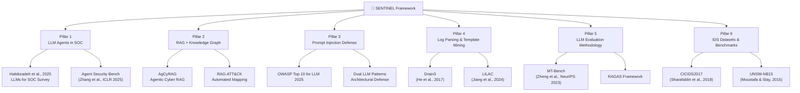

# Bản Đồ Nghiên Cứu SENTINEL — Research Roadmap
## Hướng dẫn đọc Paper chuẩn xác theo 6 Trụ Cột Nghiên Cứu

> [!IMPORTANT]
> Tất cả papers được nhóm theo **trụ cột kiến trúc** của SENTINEL. Mỗi paper được gắn rõ: TẠI SAO bạn cần đọc nó, NÓ MAP VÀO đâu trong hệ thống, và mức ĐỘ ƯU TIÊN.

---

## Sơ đồ Toàn cảnh Nghiên cứu

---

## Pillar 1️⃣: LLM Agents cho SOC Automation
> **Map vào SENTINEL:** Tier 2 Intelligence Layer — LangGraph Agent, Feedback Loop, HITL

### 🔴 Must-Read (Đọc đầu tiên)

| # | Paper | Năm | Tại sao quan trọng |
|---|---|---|---|
| 1 | **"Large Language Models for Security Operations Centers: A Comprehensive Survey"** — Habibzadeh et al. | 2025 | Survey toàn cảnh nhất về LLM trong SOC. Bạn cần trích dẫn paper này trong Literature Review để chứng minh bạn nắm toàn bộ landscape. |
| 2 | **"Agent Security Bench (ASB): Formalizing and Benchmarking Attacks and Defenses in LLM-based Agents"** — Zhang et al. | ICLR 2025 | Paper gốc mà bạn đã reference. ASR >84% chứng minh LLM Agents cực kỳ dễ bị tấn công → justify toàn bộ lý do tồn tại của Guardrails Layer. arXiv: `2410.02644` |
| 3 | **"Generative AI in Cybersecurity: A Comprehensive Review"** — Oniagbi et al. | 2024 | Đã có trong References. Tổng hợp ứng dụng GenAI trong Security, bao gồm cả rủi ro Data Privacy khi dùng Cloud API (GPT-4) → justify Local LLM (Gemma). |

### 🟡 Supporting Papers

| # | Paper | Map vào |
|---|---|---|
| 4 | **"AI-Augmented SOC: A Survey of LLMs and Agents for Security Automation"** — MDPI, 2025 | Literature Review — phân loại các chức năng SOC (Triage, Enrichment, Response) |
| 5 | **LangGraph Documentation: State Management for LLM Workflows** — LangChain | Tier 2 — Structured MemoryObject, StateGraph, Reducer functions |
| 6 | **"Autonomous SecOps: Multi-Agent Architectures for Security Operations"** — (tìm trên arXiv "multi-agent SOC 2025") | Feedback Loop concept — Agent tự sinh Rule |

### 🔬 Nhóm nghiên cứu nên theo dõi
- **LangChain / LangGraph Team** (Harrison Chase) — Framework gốc mà bạn dùng
- **AGI Research Lab (Rutgers University)** — Tác giả ASB, chuyên về Agent Security
- **Google DeepMind** — Gemma model family, adversarial robustness

---

## Pillar 2️⃣: RAG + Knowledge Graph cho Cybersecurity
> **Map vào SENTINEL:** Dual-RAG Engine (FAISS + MITRE ATT&CK + ISO 27001), Semantic Cache

### 🔴 Must-Read

| # | Paper | Năm | Tại sao quan trọng |
|---|---|---|---|
| 1 | **"AgCyRAG: Agentic Cybersecurity RAG"** — CEUR-WS | 2024 | Framework gần nhất với Dual-RAG của bạn. Kết hợp KG reasoning + vector retrieval. So sánh trực tiếp trong Related Work. |
| 2 | **"RAG-ATT&CK: Automated MITRE Mapping with Retrieval-Augmented Generation"** — Univ. of Twente | 2024 | Paper gốc về RAG cho MITRE. Bạn *mở rộng* bằng cách thêm ISO 27001 (Dual-RAG) — đây là điểm mới. |
| 3 | **"CyKG-RAG: Integrating Cybersecurity Knowledge Graphs with RAG"** — CEUR-WS | 2024 | Cách xây dựng Knowledge Graph cho Security. Hữu ích khi bạn code `embedder.py` + `retriever.py`. |

### 🟡 Supporting Papers

| # | Paper | Map vào |
|---|---|---|
| 4 | **"GraphCyRAG"** — PNNL (Pacific Northwest National Lab) | Kiến trúc Neo4j cho CVE/CWE/CAPEC, tham khảo cách tổ chức knowledge_base |
| 5 | **"Extending RAGAS for Knowledge Graph-based Reasoning"** — arXiv 2024 | Cách evaluate RAG trong bối cảnh KG + multi-hop → map vào Evaluation Plan mục 5.4 |
| 6 | **RAGAS Documentation** — ragas.io | Framework đo Context Precision, Answer Relevancy cho 200 Ground Truth mẫu |

### 🔬 Nhóm nghiên cứu nên theo dõi
- **PNNL Cyber AI Lab** — GraphCyRAG, Knowledge Graph Security
- **University of Twente** — RAG-ATT&CK, Automated Threat Intel
- **Explodinggradients (RAGAS team)** — Framework evaluation RAG

---

## Pillar 3️⃣: Prompt Injection Defense & Adversarial Robustness
> **Map vào SENTINEL:** `prompt_filter.py` (Dynamic Delimiters + Encapsulation), Guardrails Layer

### 🔴 Must-Read

| # | Paper | Năm | Tại sao quan trọng |
|---|---|---|---|
| 1 | **OWASP Top 10 for LLM Applications** | 2025 | Tài liệu chuẩn mực #1. LLM01 (Prompt Injection) là rủi ro số 1 → justify toàn bộ Guardrails Layer. |
| 2 | **"Not what you've signed up for: Compromising Real-World LLM-Integrated Applications with Indirect Prompt Injection"** — Greshake et al. | 2023 | Paper gốc định nghĩa Indirect Prompt Injection. Log chứa payload injection = indirect injection → đây là threat model chính của SENTINEL. arXiv: `2302.12173` |
| 3 | **"Dual LLM Patterns for Prompt Injection Defense"** — (Simon Willison / research blogs + GitHub) | 2024 | Kiến trúc "Privileged LLM" + "Quarantined LLM" → tương tự cách bạn tách 9B (Agent) và 26B (Judge). |

### 🟡 Supporting Papers

| # | Paper | Map vào |
|---|---|---|
| 4 | **"The Attacker Moves Second"** — Joint OpenAI/Anthropic/DeepMind research | Chứng minh adaptive attacks vẫn phá được guardrails tĩnh → justify Dynamic Randomized Delimiters |
| 5 | **NVIDIA NeMo Guardrails Documentation** | Tham khảo kiến trúc guardrails thương mại, so sánh với cách tiếp cận Encapsulation của bạn |
| 6 | **"Instruction Hierarchy: Training LLMs to Prioritize Privileged Instructions"** — Wallace et al. (OpenAI) | arXiv: `2404.13208`. System prompt > User prompt hierarchy |
| 7 | **MITRE ATLAS (Adversarial Threat Landscape for AI Systems)** | Framework threat modeling cho AI — bổ sung cho ATT&CK |

### 🔬 Nhóm nghiên cứu nên theo dõi
- **OWASP AI Security Team** — Cập nhật liên tục threat landscape
- **Google DeepMind Red Team** — Adversarial robustness cho Gemma
- **Simon Willison** — Researcher/Blogger hàng đầu về Prompt Injection

---

## Pillar 4️⃣: Log Parsing & Template Mining
> **Map vào SENTINEL:** `template_miner.py` (Drain3), Volume Compression, Token Budgeting

### 🔴 Must-Read

| # | Paper | Năm | Tại sao quan trọng |
|---|---|---|---|
| 1 | **"Drain: An Online Log Parsing Approach with Fixed Depth Tree"** — He et al. | ICWS 2017 | Paper gốc của Drain. Phải đọc để hiểu thuật toán Fixed Depth Tree + similarity threshold. Đã trong References. |
| 2 | **"LILAC: Log Parsing using LLMs with Adaptive Parsing Cache"** — Jiang et al. (Concordia Univ.) | 2024 | Framework LLM + Cache cho log parsing. Concept "Adaptive Cache" tương tự Semantic Cache của bạn. |
| 3 | **"System Log Parsing with Large Language Models: A Comprehensive Review"** | Late 2024/ Early 2025 | Survey tổng hợp tất cả phương pháp LLM cho log parsing. Tuyệt vời cho Literature Review. |

### 🟡 Supporting Papers

| # | Paper | Map vào |
|---|---|---|
| 4 | **"LLM-SrcLog: Combining Static Code Analysis with LLMs for Log Parsing"** — arXiv | Tham khảo cách hybrid Drain3 + LLM. Drain3 = fallback, LLM = semantic layer |
| 5 | **Drain3 GitHub Repository** — IBM/logpai/Drain3 | Source code reference cho `template_miner.py` |

### 🔬 Nhóm nghiên cứu nên theo dõi
- **LogPAI Group (Chinese University of Hong Kong)** — Tác giả Drain gốc, cũng publish LogHub, LogBench
- **Concordia University (Montreal)** — LILAC, adaptive log parsing
- **IBM Research** — Maintain Drain3 open-source

---

## Pillar 5️⃣: LLM Evaluation Methodology
> **Map vào SENTINEL:** Evaluation Plan (4D Framework), RAGAS, LLM-as-a-Judge (Oracle Model)

### 🔴 Must-Read

| # | Paper | Năm | Tại sao quan trọng |
|---|---|---|---|
| 1 | **"Judging LLM-as-a-Judge with MT-Bench and Chatbot Arena"** — Zheng et al. | NeurIPS 2023 | Paper gốc bạn đã reference. BẮT BUỘC phải đọc kỹ phần **Bias**: Position Bias, Verbosity Bias, Self-Enhancement Bias → justify dùng 26B judge thay vì 9B self-evaluation. |
| 2 | **RAGAS: Automated Evaluation of Retrieval Augmented Generation** — Shahul Es et al. | 2023 | Framework gốc cho Context Precision + Answer Relevancy. Hiểu rõ cách RAGAS tính toán để biết khi nào cần Ground Truth, khi nào không. |

### 🟡 Supporting Papers

| # | Paper | Map vào |
|---|---|---|
| 3 | **"TruLens: Evaluation and Tracking for LLM Experiments"** — TruEra | Alternative framework cho RAGAS, tham khảo thêm metrics |
| 4 | **"G-Eval: NLG Evaluation using GPT-4 with Chain-of-Thoughts"** — Liu et al. | LLM-based evaluation methodology, Chain-of-Thought scoring |
| 5 | **MLflow Documentation** — Experiment Tracking | Cách log metrics, parameters, artifacts cho Ablation Study |

### 🔬 Nhóm nghiên cứu nên theo dõi
- **LMSYS (UC Berkeley)** — Zheng et al., Chatbot Arena, MT-Bench
- **Explodinggradients** — RAGAS team
- **TruEra** — TruLens evaluation framework

---

## Pillar 6️⃣: IDS Datasets & Benchmarking
> **Map vào SENTINEL:** Datasets (CICIDS2017, UNSW-NB15, MAWILab), Ablation Study

### 🔴 Must-Read

| # | Paper | Năm | Tại sao quan trọng |
|---|---|---|---|
| 1 | **"Toward Generating a New Intrusion Detection Dataset and Intrusion Traffic Characterization"** — Sharafaldin et al. | ICISSP 2018 | Paper gốc CICIDS2017. Bắt buộc cite. Đọc kỹ để nắm profiling agent methodology. |
| 2 | **"UNSW-NB15: A Comprehensive Data Set for Network Intrusion Detection"** — Moustafa & Slay | MilCIS 2015 | Paper gốc UNSW-NB15. 49 features, 9 attack families. |
| 3 | **"MAWILab: Combining Diverse Anomaly Detectors for Automated Anomaly Labeling and Analysis"** — Fontugne et al. | CoNEXT 2010 | Paper gốc MAWILab. Đọc để hiểu format chuyển đổi pcap → tabular cho pipeline. |

### 🟡 Supporting Papers

| # | Paper | Map vào |
|---|---|---|
| 4 | **Recent Survey: "Deep Learning for IDS: A Comprehensive Review" (2023–2024)** — Tìm trên IEEE/arXiv | So sánh CNN, LSTM, Hybrid trên CICIDS2017. Dùng số liệu F1-Score làm baseline so sánh. |
| 5 | **"CSE-CIC-IDS2018"** — Sharafaldin et al. (2018 dataset update) | Chuẩn bị phản biện: "Tại sao không dùng dataset mới hơn?" → Trả lời: CICIDS2017 cho phép so sánh trực tiếp với 500+ papers đã publish. |

### 🔬 Nhóm nghiên cứu nên theo dõi
- **Canadian Institute for Cybersecurity (CIC), UNB** — Tác giả CICIDS2017/2018
- **UNSW Canberra (Australian Defence Force Academy)** — UNSW-NB15
- **WIDE Project / MAWILab** — Traffic measurement infrastructure

---

## THỨ TỰ ĐỌC PAPER (Ưu tiên thời gian)

> [!TIP]
> Bạn chỉ có 8 tuần. Đọc theo thứ tự này để tối ưu thời gian:

### Tuần 1-2: Foundation (8 papers cốt lõi)
1. ⭐ Habibzadeh et al. (2025) — Survey LLM in SOC **(nắm toàn cảnh)**
2. ⭐ OWASP Top 10 for LLM (2025) **(threat model)**
3. ⭐ Zhang et al., ASB (ICLR 2025) **(justify Guardrails)**
4. ⭐ Zheng et al., MT-Bench (NeurIPS 2023) **(evaluation method)**
5. He et al., Drain (2017) **(thuật toán parsing)**
6. Sharafaldin et al., CICIDS2017 (2018) **(dataset)**
7. Greshake et al., Indirect Prompt Injection (2023) **(attack model)**
8. RAGAS Documentation **(evaluation tool)**

### Tuần 3-4: Applied Research (6 papers chuyên sâu)
9. AgCyRAG — Agentic Cyber RAG **(benchmark cho Dual-RAG)**
10. RAG-ATT&CK — Automated Mapping **(so sánh trực tiếp)**
11. LILAC — LLM + Adaptive Cache **(justify Semantic Cache)**
12. Oniagbi et al. (2024) **(GenAI in Cybersecurity)**
13. Instruction Hierarchy — Wallace et al. **(prompt security)**
14. Moustafa & Slay, UNSW-NB15 (2015) **(dataset 2)**

### Tuần 5-8: Bổ sung khi viết luận văn
15-20. Các supporting papers còn lại, chọn theo chương đang viết.

---

## TÓM TẮT: 6 TRỤ CỘT → MAP VÀO SENTINEL

| Trụ cột | Module trong Code | Paper cốt lõi nhất | Điều bạn cần chứng minh |
|---|---|---|---|
| **1. LLM Agent SOC** | `agent/workflow.py` | ASB (ICLR 2025) | Agent dễ bị tấn công → cần Guardrails |
| **2. RAG + KG** | `rag/retriever.py` | AgCyRAG, RAG-ATT&CK | Dual-RAG (MITRE+ISO) tốt hơn Single-RAG |
| **3. Prompt Injection** | `guardrails/prompt_filter.py` | OWASP Top 10, Greshake 2023 | Dynamic Delimiters chống được Smuggling |
| **4. Log Parsing** | `guardrails/template_miner.py` | Drain (He 2017), LILAC 2024 | Drain3 = Token Budgeting, không phải Injection Defense |
| **5. Evaluation** | `experiments/` | Zheng 2023, RAGAS | Oracle Model 26B tránh Self-Evaluation Bias |
| **6. IDS Datasets** | `data/raw/` | Sharafaldin 2018 | CICIDS2017 = benchmark chuẩn, so sánh trực tiếp |
